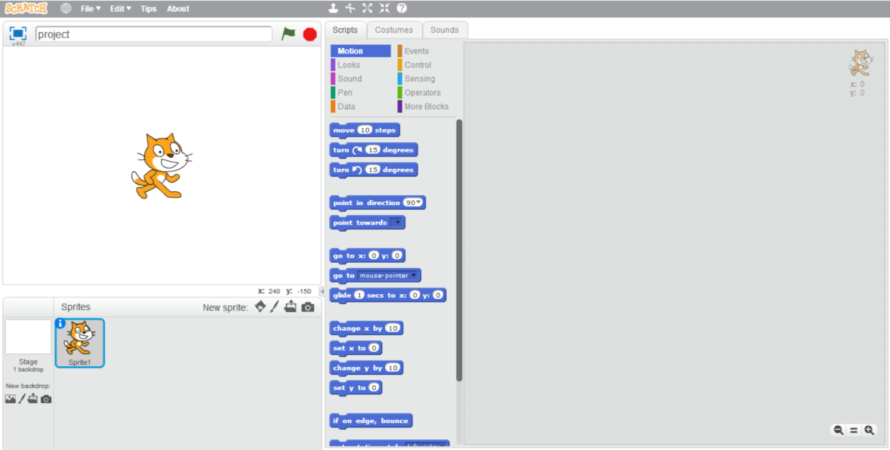

## Making Games from Scratch

Today you will work to create a simple game using MIT Scratch, which is a drag-and-drop programming environment in which you will connect blocks to make your program work.

The game that we will be creating is based on Snake – you may have played a similar game before!

### 1. Getting Started

- Download Scratch Portable

### 2. The Scratch Editor

The Scratch editor should be open on your computer. The left-hand area contains the “stage”, where you will be able to view your program when it runs. You can also modify the images (known as sprites) which you will modify to create the game. The palette of blocks in the centre are used to create the logic of your program. Drag blocks into the area on the right-hand area to start building your program.



```markdown
Syntax highlighted code block

# Header 1
## Header 2
### Header 3

- Bulleted
- List

1. Numbered
2. List

**Bold** and _Italic_ and `Code` text

[Link](url) and 
```

For more details see [GitHub Flavored Markdown](https://guides.github.com/features/mastering-markdown/).

### Jekyll Themes

Your Pages site will use the layout and styles from the Jekyll theme you have selected in your [repository settings](https://github.com/ashattefeduni/making-games-from-scratch/settings). The name of this theme is saved in the Jekyll `_config.yml` configuration file.

### Support or Contact

Having trouble with Pages? Check out our [documentation](https://help.github.com/categories/github-pages-basics/) or [contact support](https://github.com/contact) and we’ll help you sort it out.
